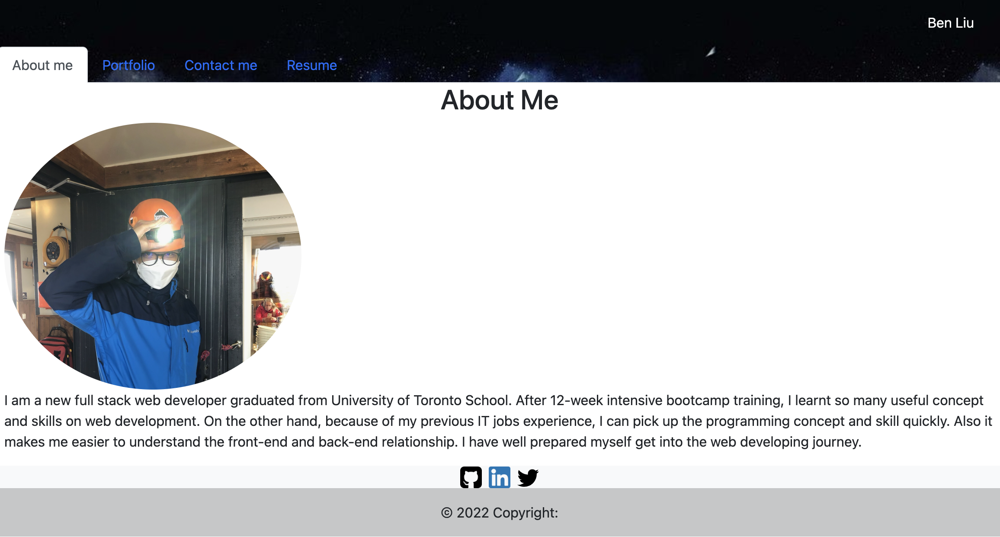

# Portfolio by React

## Description

This project is creating a single-page portfolio webpage by using react library

## Table of Contents

- [Installation](#installation)
- [Usage](#usage)
- [Credits](#credits)
- [License](#license)
- [Tests](#tests)

## Installation

N/A

## Usage

1. Go to URL https://benliu104.github.io/react-portfolio/
   

2. The page contain 4 sections: About me, portfolio, contact & resume

3. 'About me' section presents a simply introduction of me.

4. 'portfolio' section displays 6 of my application.

5. 'contact' section provide a contact form to contact me.

6. 'resume' section presents my skill set on web developing and you can download my resume.

## Credits

BenLiu104 : https://github.com/BenLiu104

## License

License - MIT

## Tests

N/A
